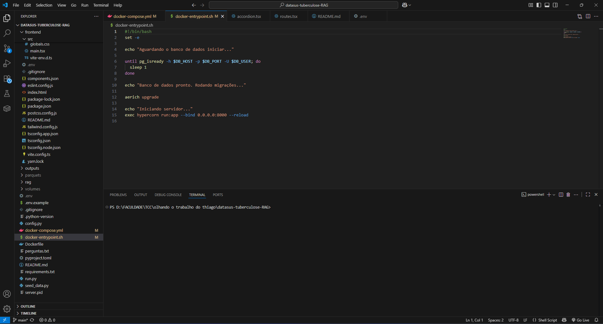

# Análise de Tuberculose - Backend

Projeto de conclusão de curso do CEFET/RJ
O objetivo do sistema é auxiliar pesquisadores da área da saúde, especialmente pesquisadores que realizam estudos epidemiologicos sobre o perfil da tubercolose, a desenvolverem suas pesquisas de uma forma facilitada, através de um chat interativo que possui os dados do datasus no contexto.

## Pré Requisitos

1. Docker instalado

   Se você não possui o docker instalado, visite https://www.docker.com/get-started/

2. Chave de API do Gemini

   Se você não tem uma chave de API, visite https://aistudio.google.com/app/apikey (o Gemini possui limite gratuito. você pode alterar o modelo usado no llm_service.py)

3. yarn ou npm

## Como começar

1. Clone o repositório:

   ```bash
   git clone https://github.com/thiago1591/datasus-tuberculose-RAG
   ```

2. Navegue até o diretório do projeto:

   ```bash
   cd tuberculosis-analysis
   ```

3. Crie o arquivo .env

   ```cp .env.example .env``` (linux/mac)


   ```copy .env.example .env``` (windows)

   Coloque a sua chave de API do Gemini em LLM_KEY

3.1. Trocar no menu inferior do arquivo docker-entrypoint.sh CRLF para LF 


3.2 No arquivo docker compose.yml trocar a ultima linha para
```
   command: ["/app/docker-entrypoint.sh"]
```

4. Rode o Docker
   ```bash
      docker compose up
   ```

   Esse comando irá subir o banco de dados e a API

5. Rode as seeds
   ```bash
    docker exec -it api python3 seed_data.py
   ```

6. Importe os dados do datasus

   faça um get para
   ```bash
   http://localhost:8000/etl
   ```
   é possível acompanhar os logs executando
   ```bash
   docker logs api
   ```

6. Rode o frontend (no windows use copy em vez de cp)
   ```bash
      cd frontend
      cp .env.example .env
      yarn install
      yarn dev
   ```

